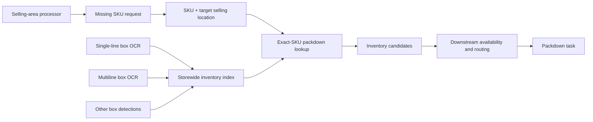

# Storewide Packdown Pipeline Architecture

## Status

This document supersedes the overhead-to-selling hard-anchor proposal in
`unified_overhead_selling_pipeline.pdf`.

The correction follows the July 16 meeting clarification: an inventory box may
be stored directly overhead, in another bay, or elsewhere in the store. Physical
proximity between an overhead box and a selling shelf is therefore not product
correspondence.

## Problem statement

The systems answer different questions:

- The selling-area system determines which SKU is missing and where it must be
  stocked.
- The single-line and multiline OCR systems determine which SKU-bearing boxes
  were observed and where those boxes were seen.

The integration objective is not to use overhead OCR to infer the selling grid.
It is to locate inventory for a SKU that the selling workflow has already
identified as missing.

## Correct data flow



## Contracts

### Missing SKU request

Produced from the selling-area empty/missing result:

```json
{
  "sku": "1000000456",
  "store_number": "0244",
  "selling_aisle": "08",
  "selling_bay": "003",
  "selling_location_id": 12,
  "selling_shelf_index": 1,
  "selling_position_index": 4,
  "confidence": 0.91
}
```

### Inventory observation

Produced by single-line or multiline box OCR:

```json
{
  "sku": "1000000456",
  "store_number": "0244",
  "inventory_aisle": "09",
  "inventory_bay": "017",
  "inventory_bbox": [90, 10, 150, 50],
  "photo_location_path": "gs://inventory/box.jpg",
  "photo_timestamp": "1770339128729",
  "process_source": "singleline",
  "confidence": 0.98
}
```

The selling location and inventory location are intentionally separate.

## Matching rules

1. Match only within the same store.
2. Use an exact normalized SKU for automatic inventory lookup.
3. Search all inventory observations storewide; do not restrict by selling bay.
4. Return all matching box observations as candidates.
5. Do not automatically convert a candidate into a stocking task. Inventory
   availability, duplicate-box resolution, routing, and employee assignment are
   downstream responsibilities.
6. Three-digit suffixes and fuzzy OCR reads may support search or review, but
   they must not create automatic packdown tasks without an additional
   disambiguation policy.

## Explicit non-goals

- No overhead-bbox to selling-price-label mapping.
- No nearest-bbox or vertical-column correspondence.
- No overhead OCR hard anchors in the selling matcher.
- No assumption that overhead stock mirrors the assortment below it.
- No cross-store inventory match.

## Implementation in this workspace

- `output/sku_payload.py` publishes rich `inventory_observations` while retaining
  the existing `skus_list` and `bounding_boxes` fields.
- `pipeline/packdown_matching.py` adapts OCR payloads, builds a storewide exact-SKU
  inventory index, converts selling empty-grid output into missing-SKU requests,
  and returns inventory candidates.
- `selling_processor.py` remains price/sequence based and does not consume
  overhead OCR results.

## Remaining production boundaries

The production selling handler and the downstream packdown task service are not
present in this workspace. Runtime integration still requires:

1. The selling owner to publish the missing-SKU request.
2. Single-line and multiline consumers to publish inventory observations into a
   storewide index.
3. A packdown service to perform the exact-SKU lookup and apply live inventory,
   routing, and task-assignment rules.

## Validation plan

Measure:

- Missing-SKU request precision from the selling system.
- Exact-SKU OCR precision for inventory observations.
- Storewide inventory lookup recall.
- Percentage of requests with one, multiple, or zero candidate boxes.
- Candidate-location accuracy.
- Packdown completion rate and time-to-restock.
- False task rate; the target for automatic exact-SKU tasks should be near zero.
