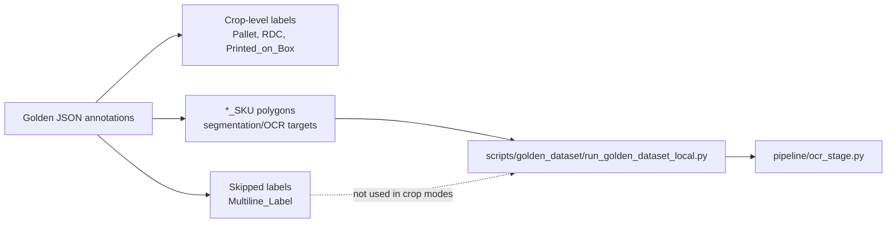
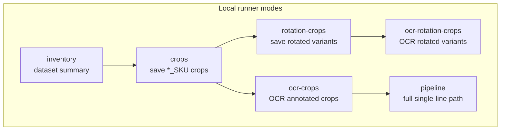
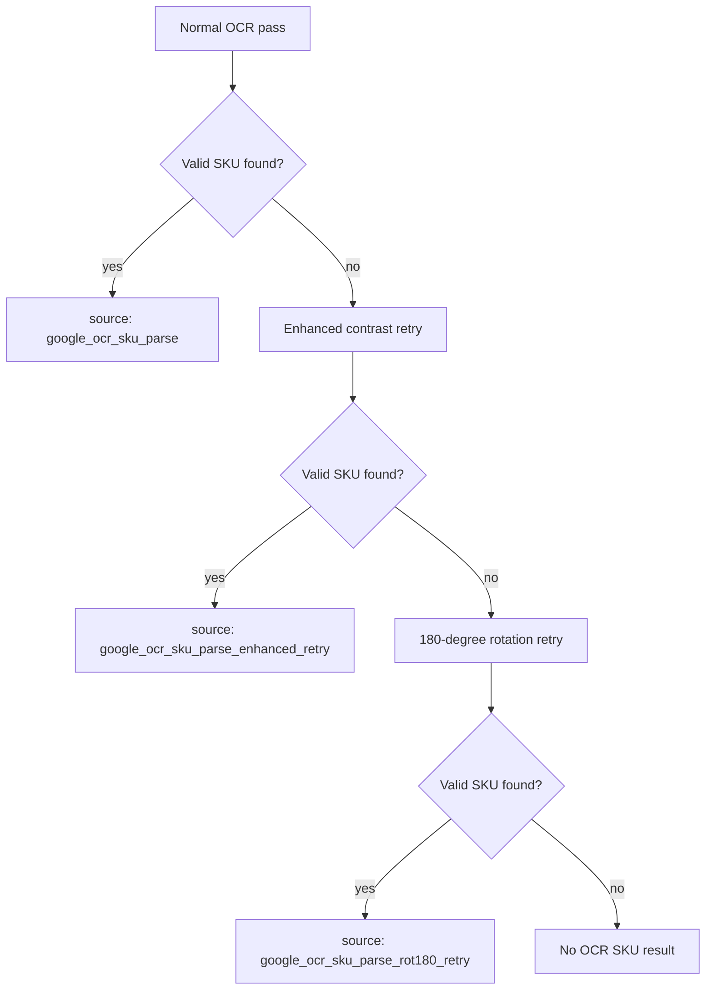
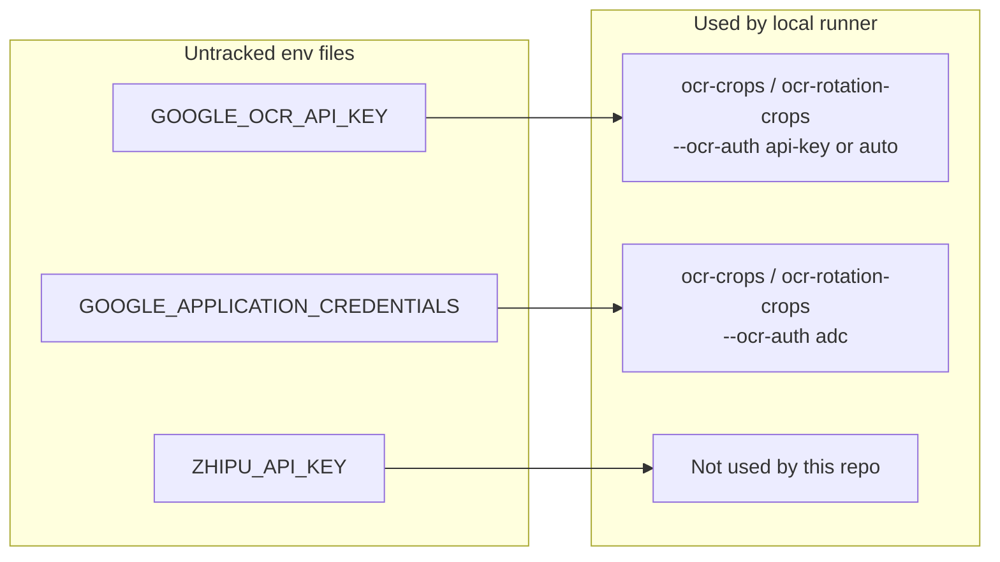
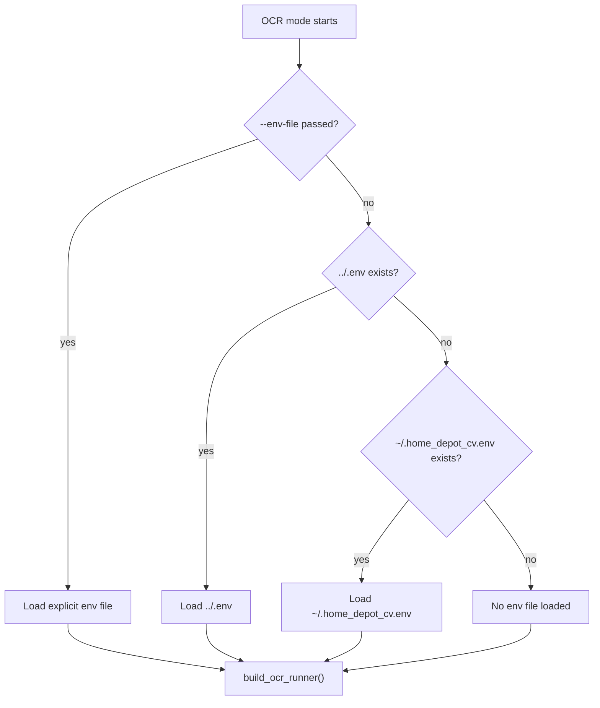
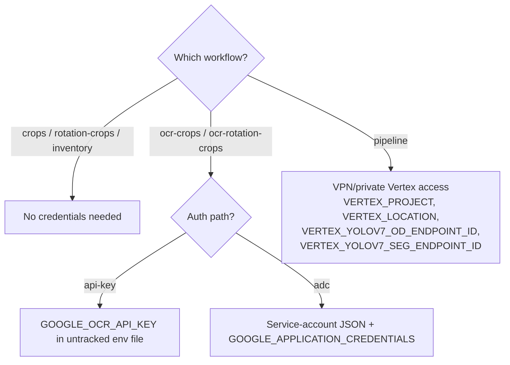
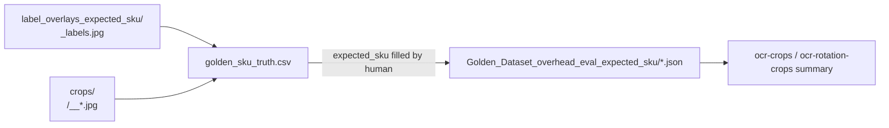
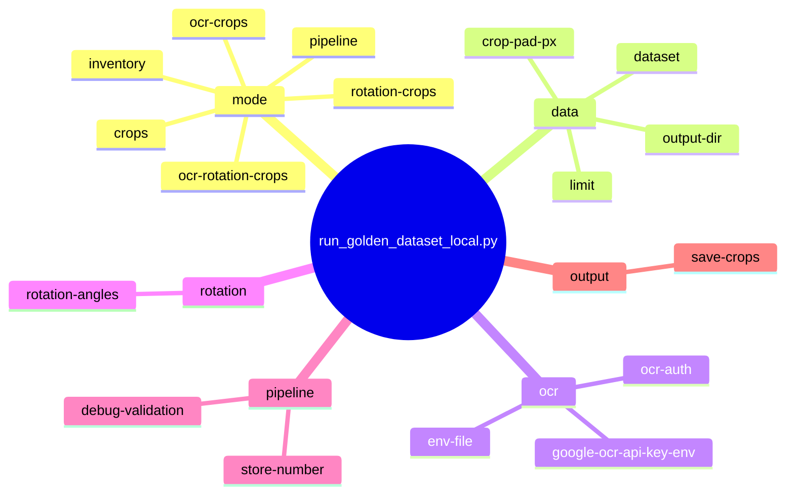

# Local Testing Guide

<!-- toc -->
## Table of Contents

| Line | Section |
| --- | --- |
| L1 | [Local Testing Guide](#local-testing-guide) |
| L33 | [What Changed And Why](#what-changed-and-why) |
| L57 | [Main Enhancements](#main-enhancements) |
| L75 | [OCR Improvements](#ocr-improvements) |
| L93 | [Rotation Improvements](#rotation-improvements) |
| L98 | [What This Does Not Do Yet](#what-this-does-not-do-yet) |
| L103 | [Credentials And Env Files](#credentials-and-env-files) |
| L177 | [Dataset](#dataset) |
| L214 | [Label Overlay Review Images](#label-overlay-review-images) |
| L246 | [Expected SKU Accuracy Workflow](#expected-sku-accuracy-workflow) |
| L295 | [OCR And Rotation Command Reference](#ocr-and-rotation-command-reference) |
| L374 | [1. Inventory Only](#1-inventory-only) |
| L387 | [2. Save Annotated SKU Crops](#2-save-annotated-sku-crops) |
| L401 | [3. OCR Annotated SKU Crops](#3-ocr-annotated-sku-crops) |
| L446 | [4. Rotation OCR Testing](#4-rotation-ocr-testing) |
| L476 | [5. Full Pipeline Run](#5-full-pipeline-run) |
<!-- /toc -->

After editing this guide, refresh the line-number table of contents with:

```bash
python scripts/docs/update_local_testing_guide_toc.py
```

Use `scripts/golden_dataset/run_golden_dataset_local.py` to test OCR and single-line pipeline changes against real overhead images. The related production label config lives in `common_config.py`, and the full single-line image path is implemented in `new_inference_pipeline_full_image.py`.

## What Changed And Why
The goal of this work is to make OCR and rotation testing understandable and repeatable without needing the full cloud pipeline to be running. In simple terms, the pipeline needs to find SKU numbers in overhead shelf images. Those numbers may be printed on labels, printed directly on boxes, tilted, upside down, blurry, or surrounded by lots of visual noise. Before this local workflow, it was hard to test whether an OCR change actually helped because running the full model pipeline depends on VPN, private Vertex endpoints, or GPU access.

We added a local testing script in `scripts/golden_dataset/run_golden_dataset_local.py` that uses the golden dataset already on disk. Each image has a matching JSON file where humans marked important regions, such as `Pallet`, `RDC`, `Pallet_SKU`, `RDC_SKU`, or `Printed_on_Box_SKU`. The crop-level labels, such as `Pallet` and `RDC`, describe broader detected label regions. The `*_SKU` labels describe the SKU polygons used for segmentation/OCR testing. The local script reads those annotations, crops out only the `*_SKU` regions, optionally sends those crops to Google OCR using a local API key, and writes CSV summaries showing what OCR returned. This lets someone inspect real SKU crops and OCR results without first needing object detection or segmentation models to run.



For code reference, `common_config.py` defines `Multiline_Label` as object-detection class `4` and sets `SKIP_CLASSES = (4,)`, so the single-line path does not process multiline labels. `services/image_inference.py` applies that skip when parsing object detection outputs. The local crop and rotation modes in `scripts/golden_dataset/run_golden_dataset_local.py` use `label.endswith("_SKU")`, which is why `Multiline_Label` and other crop-level labels are not included in OCR crop tests.

### Main Enhancements



### OCR Improvements
The OCR improvement is about giving Google OCR cleaner and more useful inputs. The OCR implementation is in `pipeline/ocr_stage.py`: it sends an image to Google and then filters the returned text down to valid SKU patterns. We kept that behavior, but added retry logic for hard cases. If the normal OCR pass does not produce a valid SKU, the code can try a high-contrast version of the same crop/image. This helps with faint text, low contrast, or labels where the SKU is visible but not easy for OCR to read.



The OCR output summary also records where the result came from. For example, `google_ocr_sku_parse` means the normal OCR pass worked, while `google_ocr_sku_parse_enhanced_retry` means the normal pass failed but the enhanced image worked. This makes the CSV useful for understanding not just whether OCR succeeded, but what kind of help it needed.

### Rotation Improvements
The rotation work targets a specific issue from the project discussion: Google OCR may handle some rotated labels, but upside-down or slightly tilted labels can fail. To test this directly, `scripts/golden_dataset/run_golden_dataset_local.py` now creates rotated versions of each annotated SKU crop. For example, one crop can produce `rot0`, `rot180`, `rotneg10`, `rot10`, `rotneg5`, and `rot5` images.

This is useful because it turns rotation into something measurable. Instead of saying "OCR struggles with rotation," we can compare OCR results across each angle. If `rot0` works but `rot180` fails, that points to an upside-down label problem. If `rotneg10` or `rot10` fails, that points to a tilt/deskew problem. The production OCR code also has a 180-degree retry path, so if normal OCR fails, it can try the upside-down version and map the result back to the original image coordinates.

### What This Does Not Do Yet
This local workflow does not prove that object detection and segmentation are working end to end. The crops are based on human annotations from the JSON files, not model predictions. That is intentional: it lets us isolate OCR behavior first. Once VPN/private Vertex or GPU model access works, the `pipeline` mode can run the full model path in `new_inference_pipeline_full_image.py` and help separate detection failures, segmentation failures, and OCR failures.

The golden dataset contains paired `.jpg` and `.json` files under `../Golden_Dataset_overhead_eval`. The JSON files contain polygon annotations such as `Pallet`, `Pallet_SKU`, `RDC`, and `RDC_SKU`. They do not contain the actual SKU text, so these tests are best for checking coverage, OCR extraction behavior, retry usage, and failure categories rather than exact SKU accuracy.

## Credentials And Env Files
Local OCR credentials are stored outside git in untracked env files. On this machine, both of these files currently exist:

```bash
/Users/avinash.patel/Downloads/HomeDepotCV/.env
/Users/avinash.patel/.home_depot_cv.env
```

Expected variables:



The local runner does not commit or auto-load secrets into git. It loads env files only when OCR modes run, using this order:



Because `GOOGLE_OCR_API_KEY` is already present, OCR testing can be enabled immediately with:

```bash
cd /Users/avinash.patel/Downloads/HomeDepotCV/cv-singleline-processor-CV-1757

python scripts/golden_dataset/run_golden_dataset_local.py --mode ocr-crops --limit 5 --save-crops --ocr-auth api-key
```

You can also pass the env file explicitly:

```bash
python scripts/golden_dataset/run_golden_dataset_local.py --mode ocr-crops --limit 5 --save-crops --ocr-auth api-key --env-file /Users/avinash.patel/Downloads/HomeDepotCV/.env
```

If you had no credentials at all, you would need:



Do not commit `.env` files or service-account JSON files to the repo.

## Dataset
Original dataset path:

```bash
../Golden_Dataset_overhead_eval
```

Expected-SKU review dataset path:

```bash
../Golden_Dataset_overhead_eval_expected_sku
```

On this machine, `scripts/golden_dataset/run_golden_dataset_local.py` now defaults to `../Golden_Dataset_overhead_eval_expected_sku` when that folder exists, and falls back to `../Golden_Dataset_overhead_eval` otherwise. The expected-SKU copy preserves the original images and polygons, but adds these placeholder fields to every `*_SKU` shape:

```json
{
  "expected_sku": "",
  "expected_sku_review_status": "needs_review",
  "expected_sku_source": "human_review"
}
```

The copied dataset should resolve from the service repo to:

```bash
/Users/avinash.patel/Downloads/HomeDepotCV/Golden_Dataset_overhead_eval_expected_sku
```

Human reviewers should fill `expected_sku` for each `*_SKU` region in the copied JSON files, or fill the CSV review template:

```bash
/Users/avinash.patel/Downloads/HomeDepotCV/research_outputs/golden_dataset_local_tests/golden_sku_truth.csv
```

After `expected_sku` is populated, OCR summary outputs include `expected_sku`, `accuracy_status`, and `ocr_match`, and the runner prints an accuracy summary. Blank `expected_sku` values are reported as `needs_ground_truth`, not as failures.

## Label Overlay Review Images
To make manual SKU transcription easier, the expected-SKU dataset can be rendered as annotated image overlays. Each output image draws every JSON polygon directly on top of the source image, includes a color legend, and labels each region as `shape_idx:label`. If `expected_sku` is filled in later, the overlay label includes that value too.

Generated overlay folder:

```bash
/Users/avinash.patel/Downloads/HomeDepotCV/research_outputs/golden_dataset_local_tests/label_overlays_expected_sku
```

Example output:

```bash
/Users/avinash.patel/Downloads/HomeDepotCV/research_outputs/golden_dataset_local_tests/label_overlays_expected_sku/1770339044281_0244_1026_07-019_labels.jpg
```

Regenerate all label overlays:

```bash
python scripts/golden_dataset/generate_golden_label_overlays.py \
  --dataset /Users/avinash.patel/Downloads/HomeDepotCV/Golden_Dataset_overhead_eval_expected_sku \
  --output-dir /Users/avinash.patel/Downloads/HomeDepotCV/research_outputs/golden_dataset_local_tests/label_overlays_expected_sku
```

Optional SKU-only view:

```bash
python scripts/golden_dataset/generate_golden_label_overlays.py \
  --dataset /Users/avinash.patel/Downloads/HomeDepotCV/Golden_Dataset_overhead_eval_expected_sku \
  --output-dir /Users/avinash.patel/Downloads/HomeDepotCV/research_outputs/golden_dataset_local_tests/label_overlays_expected_sku_only \
  --sku-only
```

## Expected SKU Accuracy Workflow
The accuracy workflow needs human-entered truth before it can report real OCR accuracy. The review CSV has one row per `*_SKU` shape, with `crop_path` for the tight crop and `overlay_path` for the full labeled image context:

```bash
/Users/avinash.patel/Downloads/HomeDepotCV/research_outputs/golden_dataset_local_tests/golden_sku_truth.csv
```

Human review step:



After reviewers fill `expected_sku` in the CSV, sync those values into the copied JSON dataset:

```bash
python scripts/golden_dataset/sync_expected_sku_from_truth_csv.py
```

Preview without writing:

```bash
python scripts/golden_dataset/sync_expected_sku_from_truth_csv.py --dry-run
```

Then rerun OCR. Once any `expected_sku` values exist, the output CSV includes `expected_sku`, `accuracy_status`, and `ocr_match`, and the command prints a real accuracy summary over reviewed rows:

```bash
python scripts/golden_dataset/run_golden_dataset_local.py --mode ocr-crops --limit 5 --save-crops --ocr-auth api-key
```

Rotation accuracy:

```bash
python scripts/golden_dataset/run_golden_dataset_local.py --mode ocr-rotation-crops --limit 5 --rotation-angles 0,180,-10,10,-5,5 --ocr-auth api-key
```

If `expected_sku` is blank, the runner reports `needs_ground_truth`. That is intentional and prevents confusing OCR hit rate with true accuracy.

## OCR And Rotation Command Reference
Run these commands from the service repo:

```bash
cd /Users/avinash.patel/Downloads/HomeDepotCV/cv-singleline-processor-CV-1757
```

Create local SKU crops without OCR. This is the quickest offline check that the JSON `*_SKU` polygons are being cropped correctly:

```bash
python scripts/golden_dataset/run_golden_dataset_local.py --mode crops --limit 5
```

Run OCR against annotated SKU crops using Application Default Credentials or a service account:

```bash
python scripts/golden_dataset/run_golden_dataset_local.py --mode ocr-crops --limit 5 --save-crops --ocr-auth adc
```

Run OCR against annotated SKU crops using a local API-key env file. If `--env-file` is omitted, the script auto-detects `../.env` then `~/.home_depot_cv.env`:

```bash
python scripts/golden_dataset/run_golden_dataset_local.py --mode ocr-crops --limit 5 --save-crops --ocr-auth api-key
```

Generate rotated SKU crop variants without OCR. This does not require network access or Google credentials:

```bash
python scripts/golden_dataset/run_golden_dataset_local.py --mode rotation-crops --limit 5 --rotation-angles 0,180,-10,10,-5,5
```

Run OCR against the rotated SKU crop variants using Application Default Credentials or a service account:

```bash
python scripts/golden_dataset/run_golden_dataset_local.py --mode ocr-rotation-crops --limit 5 --rotation-angles 0,180,-10,10,-5,5 --ocr-auth adc
```

Run OCR against the rotated SKU crop variants using a local API-key env file:

```bash
python scripts/golden_dataset/run_golden_dataset_local.py --mode ocr-rotation-crops --limit 5 --rotation-angles 0,180,-10,10,-5,5 --ocr-auth api-key
```

Optional: run the full single-line pipeline after VPN/private Vertex access is available:

```bash
CV_SINGLELINE_DEBUG_VALIDATION=true python scripts/golden_dataset/run_golden_dataset_local.py --mode pipeline --limit 5 --debug-validation
```

Relevant parameters:



## 1. Inventory Only
This mode does not call OCR or model endpoints. It summarizes how many annotated regions each image has.

```bash
python scripts/golden_dataset/run_golden_dataset_local.py --mode inventory
```

Output:

```bash
../research_outputs/golden_dataset_local_tests/inventory.csv
```

## 2. Save Annotated SKU Crops
This mode does not call OCR or model endpoints. It crops the annotated `*_SKU` polygons from each image so we can manually inspect the exact regions OCR should read.

```bash
python scripts/golden_dataset/run_golden_dataset_local.py --mode crops --limit 5
```

Outputs:

```bash
../research_outputs/golden_dataset_local_tests/crops_summary.csv
../research_outputs/golden_dataset_local_tests/crops/<image_name>/*.jpg
```

## 3. OCR Annotated SKU Crops
This mode calls Google OCR on the annotated SKU crops only. It is useful for testing OCR parser changes without needing the object detection or segmentation endpoints.

For the API-key path, only `GOOGLE_OCR_API_KEY` is required. `ZHIPU_API_KEY` is unrelated to Google OCR, and `GOOGLE_APPLICATION_CREDENTIALS` is only needed for the service-account/ADC path. The Linux path shown in older scripts, such as `/home/.../gcloud_keys/...json`, will not work locally on this Mac unless that exact JSON file is also copied here.

Create a local env file outside the repo:

```bash
nano /Users/avinash.patel/.home_depot_cv.env
```

Add:

```bash
GOOGLE_OCR_API_KEY=<your_google_ocr_api_key>
```

Then lock it down:

```bash
chmod 600 /Users/avinash.patel/.home_depot_cv.env
```

With Application Default Credentials or a service account:

```bash
python scripts/golden_dataset/run_golden_dataset_local.py --mode ocr-crops --limit 5 --save-crops
```

With a local API-key `.env` file:

```bash
python scripts/golden_dataset/run_golden_dataset_local.py --mode ocr-crops --limit 5 --save-crops --ocr-auth api-key --env-file /Users/avinash.patel/Downloads/HomeDepotCV/.env
```

Output:

```bash
../research_outputs/golden_dataset_local_tests/ocr-crops_summary.csv
```

This requires Google OCR credentials/network access. Do not commit `.env` files or service account JSON files to the repo.

Implementation note: the API-key path in `pipeline/ocr_stage.py` converts the crop image to JPEG bytes, base64-encodes it, and calls `https://vision.googleapis.com/v1/images:annotate?key=...`, matching the older local script pattern.

## 4. Rotation OCR Testing
This mode creates rotated variants of annotated SKU crops so we can test the exact issue from the transcript: Google OCR sometimes handles 90-degree labels but struggles with upside-down labels and slightly rotated labels.

Offline crop generation:

```bash
python scripts/golden_dataset/run_golden_dataset_local.py --mode rotation-crops --limit 5
```

Output:

```bash
../research_outputs/golden_dataset_local_tests/rotation-crops_summary.csv
../research_outputs/golden_dataset_local_tests/rotation_crops/<image_name>/*.jpg
```

With Google OCR credentials/network access:

```bash
python scripts/golden_dataset/run_golden_dataset_local.py --mode ocr-rotation-crops --limit 5 --rotation-angles 0,180,-10,10,-5,5 --ocr-auth api-key --env-file /Users/avinash.patel/Downloads/HomeDepotCV/.env
```

Output:

```bash
../research_outputs/golden_dataset_local_tests/ocr-rotation-crops_summary.csv
```

Use the summary to compare OCR hit rates across `0`, `180`, and slight-angle variants.

## 5. Full Pipeline Run
This mode runs the full segregated single-line pipeline on each full image. It requires VPN/private Vertex endpoint access.

```bash
CV_SINGLELINE_DEBUG_VALIDATION=true python scripts/golden_dataset/run_golden_dataset_local.py --mode pipeline --limit 5 --debug-validation
```

Outputs:

```bash
../research_outputs/golden_dataset_local_tests/pipeline_summary.csv
../research_outputs/golden_dataset_local_tests/pipeline_debug/
```

Use this after VPN/Vertex access is available to separate object detection failures, segmentation failures, OCR failures, enhanced OCR retry usage, and 180-degree retry usage.
