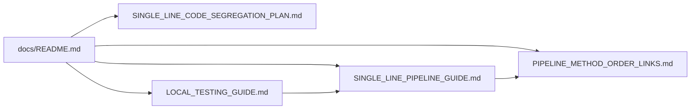
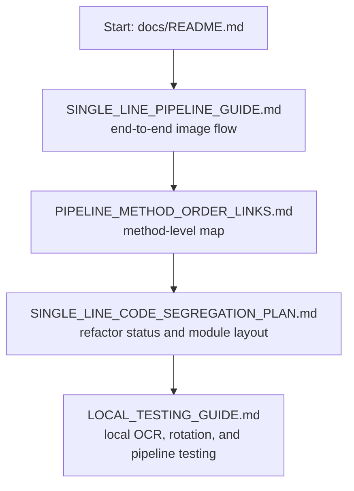

# Documentation Index

<!-- toc -->
## Table of Contents

| Line | Section |
| --- | --- |
| L1 | [Documentation Index](#documentation-index) |
| L21 | [Guide Map](#guide-map) |
| L39 | [Recommended Reading Order](#recommended-reading-order) |
<!-- /toc -->

After editing this index, refresh the line-number table of contents with:

```bash
python scripts/docs/update_docs_readme_toc.py
```

Use these docs when reviewing or onboarding to the single-line processor.

## Guide Map



## Recommended Reading Order



- `SINGLE_LINE_CODE_SEGREGATION_PLAN.md`: current refactor/segregation status, new module flow, remaining work, and Vaibhav-ready update.
- `SINGLE_LINE_PIPELINE_GUIDE.md`: prose walkthrough of one image moving through the single-line pipeline.
- `PIPELINE_METHOD_ORDER_LINKS.md`: ordered method-level reading map for the production path, updated for the new stage modules.
- `LOCAL_TESTING_GUIDE.md`: local dataset runner instructions for inventory, annotated SKU crops, OCR crop checks, rotation testing, credentials, and full pipeline validation.
