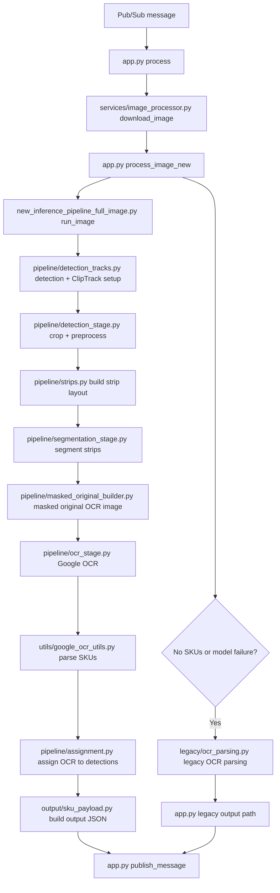
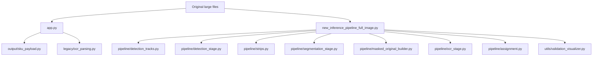
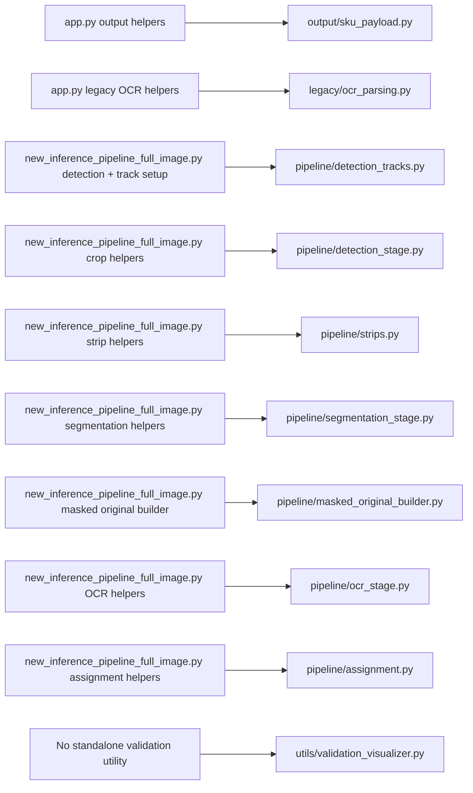
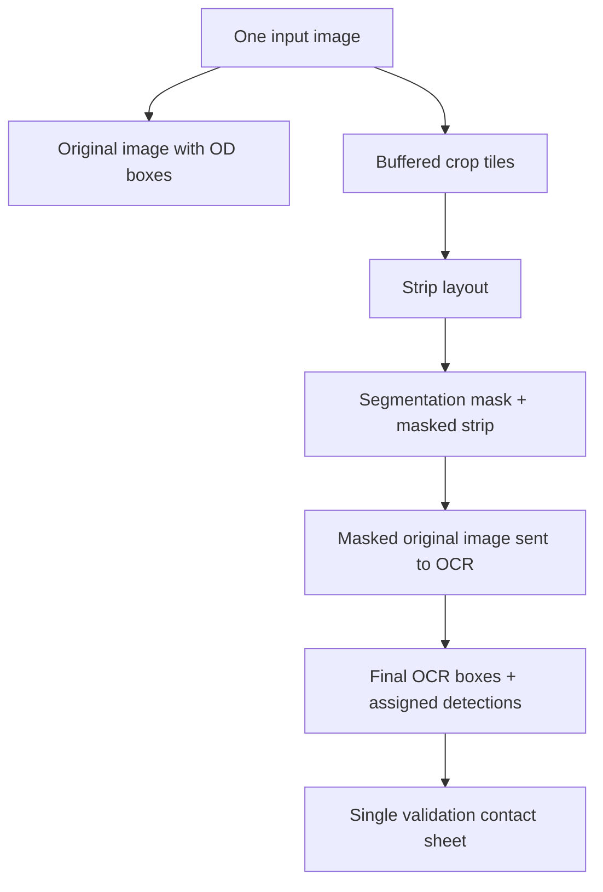
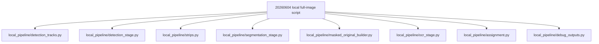

# Single-Line Code Segregation Plan
This document summarizes the behavior-preserving split of the single-line processor into smaller, easier-to-review modules. The goal is to keep the pipeline behavior the same while making each stage easier to understand, validate, and share with another team.

## New End-To-End Flow
At a high level, the service receives a Pub/Sub message that says where an image lives in Google Cloud Storage. `app.py` reads that message, downloads the image, and sends the image into the single-line pipeline.

The pipeline first finds possible single-line labels in the full image. It crops those label regions, groups the crops into strips, runs segmentation to isolate the SKU text area, and then builds a cleaner full-size image where mostly the SKU regions are visible. That cleaned image is sent to Google OCR so there is less shelf noise for OCR to read.

After OCR returns text and boxes, the code filters the text into valid SKU candidates and assigns each SKU back to the detected label it came from. Finally, the output code formats the SKU results into the expected JSON payload and `app.py` publishes that payload to the output Pub/Sub topic. If the newer model-based path fails or finds no useful SKUs, the service falls back to the older full-image OCR path.

This diagram follows one image through that process, from the incoming Pub/Sub message to the outgoing SKU result.

### Flow Explanation
| Step | File / Stage | What Gets Fed In | What The Step Does | What Comes Out |
| --- | --- | --- | --- | --- |
| 1 | `app.py::process()` | A Pub/Sub message containing image metadata, including the GCS image location and store context. | Decodes the message, extracts metadata, starts timing/metrics, and decides which image-processing path to run. | Parsed metadata plus the image location needed for download. |
| 2 | `services/image_processor.py::download_image()` | The GCS bucket/file information from the message. | Downloads the image and converts it into a NumPy image array that the CV pipeline can process. | `raw_image`, usually an RGB NumPy array. |
| 3 | `app.py::process_image_new()` | The downloaded `raw_image`, file name, and store number. | Calls the newer single-line model-based pipeline and handles its status/result contract. | A `PipelineResult` if the new pipeline succeeds, or a fallback status if it cannot produce usable SKUs. |
| 4 | `new_inference_pipeline_full_image.py::run_image()` | The full image array and source metadata. | Orchestrates the active single-line flow: detection, crop tracking, strip creation, segmentation, masked OCR, OCR parsing, assignment, and result assembly. | Structured OCR/SKU results plus metadata such as tracked clips and OCR call count. |
| 5 | `pipeline/detection_tracks.py` | The full image and detection endpoint wrapper. | Calls the object detection endpoint, handles detection failure/no-crop statuses, applies bbox buffering, and initializes `ClipTrack` records. | Buffered crops and `ClipTrack` objects that remember original bbox, buffered bbox, class, confidence, and crop size. |
| 6 | `pipeline/detection_stage.py` | Each buffered detection crop. | Extracts the crop from the original image and applies light preprocessing such as deblurring and denoising. | Cleaned crop images ready for strip layout/segmentation. |
| 7 | `pipeline/strips.py` | The list of crop/track pairs. | Groups crops, center-pads each crop within a group, concatenates them into horizontal strip images, and records strip-local coordinate bookkeeping on each `ClipTrack`. | Strip images plus crop-to-strip mapping metadata. |
| 8 | `pipeline/segmentation_stage.py` | Each strip image and its crop/track group. | Calls the segmentation endpoint, checks whether each crop has a usable SKU mask, stores masked clip regions when segmentation succeeds, and preserves full crops when segmentation fails. | Per-crop segmentation state and optional `masked_strip_clip` images. |
| 9 | `pipeline/masked_original_builder.py` | The original full image plus all segmented crop groups. | Reconstructs a full-resolution OCR input where only likely SKU regions are visible and the rest is replaced with a configured background. | `masked_original`, the image sent to Google OCR. |
| 10 | `pipeline/ocr_stage.py` | The masked-original image. | Calls Google Vision OCR and forwards the OCR annotations to the SKU parser. | Word/SKU candidate dictionaries with text, raw text, confidence, and original-image bboxes. |
| 11 | `utils/google_ocr_utils.py` | Raw OCR annotations from Google Vision. | Normalizes noisy OCR text, identifies valid 6- or 10-digit SKU candidates, and builds bbox-aware result records. | Parsed SKU candidate records. |
| 12 | `pipeline/assignment.py` | Parsed OCR bbox records and all `ClipTrack` objects. | Assigns each OCR result back to the detected label that produced it using bbox containment and overlap fallback. | OCR results connected to detection class, detection id, and original image region. |
| 13 | `output/sku_payload.py` | `PipelineResult`, image metadata, bucket/file info, and parsed OCR/SKU results. | Formats the normalized output schema expected downstream, including SKU text and legacy bbox string fields. | Final JSON payload. |
| 14 | `app.py::publish_message()` | The final JSON payload. | Publishes the result to the configured output Pub/Sub topic and logs completion metrics. | Downstream SKU result message. |
| Fallback | `legacy/ocr_parsing.py` and legacy `app.py` path | The original OCR response or failure/no-SKU status from the new pipeline. | Uses the older full-image OCR parsing and bbox extraction logic when the new model path fails or finds no publishable SKUs. | A legacy-compatible JSON payload that can still be published. |

## New Module Structure

### Implemented Modules
- `output/sku_payload.py`: `SkuData`, output JSON encoding, SKU normalization, bbox string formatting, and new-pipeline result JSON.
- `legacy/ocr_parsing.py`: legacy fallback SKU extraction and OCR bbox matching helpers.
- `pipeline/detection_tracks.py`: detection endpoint fallback handling, buffered crop extraction, `ClipTrack` initialization, and clip-item packaging.
- `pipeline/detection_stage.py`: crop extraction, deblur, denoise, and crop preprocessing helpers.
- `pipeline/strips.py`: crop grouping, center padding, and strip coordinate layout.
- `pipeline/segmentation_stage.py`: strip segmentation prediction, binary mask normalization, mask expansion, per-crop segmentation checks, and masked strip clips.
- `pipeline/masked_original_builder.py`: full-resolution masked-original image reconstruction for the single OCR call.
- `pipeline/ocr_stage.py`: Google OCR call and handoff to SKU parsing.
- `pipeline/assignment.py`: OCR word-to-detection assignment and bbox helper functions.
- `utils/validation_visualizer.py`: contact-sheet generator wired behind `CV_SINGLELINE_DEBUG_VALIDATION`.

## Old-To-New Mapping

Compatibility note: `app.py` still imports extracted output and legacy helpers, and `HomeDepotInferencePipeline` keeps wrapper methods for extracted detection/crop, strip, segmentation, OCR, and assignment helpers. This keeps existing tests and imports working while the implementation lives in smaller files.

## What Was Extracted
### From `app.py`
- `SkuData` -> `output/sku_payload.py::SkuData`
- `encoder_sku_data()` -> `output/sku_payload.py::encoder_sku_data()`
- `prepare_sku_result_json_new()` -> `output/sku_payload.py::prepare_sku_result_json_new()`
- `normalize_sku_text()` -> `output/sku_payload.py::normalize_sku_text()`
- `bbox_to_legacy_string()` -> `output/sku_payload.py::bbox_to_legacy_string()`
- `find_sku_entities()` -> `legacy/ocr_parsing.py::find_sku_entities()`
- `detect_bounding_box()` -> `legacy/ocr_parsing.py::detect_bounding_box()`
- `find_bounding_values()` -> `legacy/ocr_parsing.py::find_bounding_values()`
- `structure_bounding()` -> `legacy/ocr_parsing.py::structure_bounding()`

### From `new_inference_pipeline_full_image.py`
- Detection endpoint fallback handling, `ClipTrack` initialization, and clip item packaging -> `pipeline/detection_tracks.py`
- `crop()`, `_preprocess()`, `_deblur()`, `_denoise()` -> `pipeline/detection_stage.py`
- `group_clip_items()`, `center_pad()`, `create_strip()` -> `pipeline/strips.py`
- `_mask_single_strip()`, `_predict_binary_strip_mask()`, `process_binary_mask_with_rotation()`, `_apply_mask_to_strip_preserve_unsegmented_clips()`, `_clip_has_segmentation()`, `_apply_mask_to_strip()` -> `pipeline/segmentation_stage.py`
- `_build_masked_original_image()` implementation -> `pipeline/masked_original_builder.py`
- `_run_google_ocr_words()`, `_call_google_ocr_np()` -> `pipeline/ocr_stage.py`
- `_assign_word_to_track_in_original()`, `_bbox_center()`, `_point_in_bbox()` -> `pipeline/assignment.py`

## Validation Contact Sheet Plan

`utils/validation_visualizer.py` is wired behind `CV_SINGLELINE_DEBUG_VALIDATION`. It is off by default; when enabled, it writes a contact sheet to `debug_outputs/` showing detections, buffered crops, segmentation clips, masked OCR input, and final OCR boxes.

## OCR Issues And Improvements
The main OCR issues called out by the plan/code and the June 25 transcript are shelf noise, weak or missing segmentation masks, SKU digits getting split across OCR tokens, unrelated OCR tokens getting accidentally merged, low-contrast text on labels, and Google OCR sensitivity to image size/layout. The transcript also calls out two bigger concerns: Google OCR has latency/cost overhead, and upside-down single-line labels are hard because unlike multiline labels, most single-line classes do not have reliable anchor points for orientation correction.

The current parser already reduces false positives by only merging OCR tokens inside the same Google full-text line and by requiring normalized 6- or 10-digit SKU formats. The new improvement keeps Google OCR as the primary engine, but adds safe fallback inputs: if the first masked-original OCR pass returns no parsed SKUs, `pipeline/ocr_stage.py` retries once using a same-size high-contrast version of that image; if that still fails, it retries a 180-degree rotated version for upside-down labels and maps the returned OCR boxes back to original image coordinates. Retry results are tagged with `_enhanced_retry` or `_rot180_retry`, and pipeline metadata records which retry was used.

The longer-term alternative is to evaluate task-specific OCR or a custom digit detection model, similar to the multiline pipeline direction mentioned in the transcript. That would reduce dependency on Google OCR cost/latency, but it needs orientation handling first: quantify how many labels are rotated/upside down, check which label classes have usable anchors, and use validation contact sheets to separate object detection failures, segmentation failures, and OCR failures.

## Local R&D Script Segregation
The standalone local script at `../20260604_veb_new_inference_pipeline_local_2_fullimage.py` has also been split into `../local_pipeline/` modules. This keeps the VM-oriented YOLO setup and batch runner in the original script while moving reusable stage logic into smaller files.

Local verification is limited to syntax/lint checks because this script depends on VM-specific YOLO repos, CUDA devices, model weights, and local image paths.

## Status And Upcoming Work
The first segregation pass is complete: `app.py` owns service orchestration, `new_inference_pipeline_full_image.py` mostly coordinates stage modules, the local R&D script has matching `local_pipeline/` modules, validation contact sheets are available behind `CV_SINGLELINE_DEBUG_VALIDATION`, and `scripts/golden_dataset/run_golden_dataset_local.py` can run inventory/crop/OCR/full-pipeline checks on the golden overhead dataset. The next step is running OCR crop checks with Google credentials and full runtime validation with VPN/private Vertex access, followed by optional deeper fixture-based tests using real endpoint outputs.
