# Home Depot Single-Line Detector

## TorchServe Migration Guide

> Documentation for the migration of the Home Depot Single-Line Detection pipeline from standalone YOLOv7 inference scripts into a production-ready TorchServe GPU inference service.

---

# 1. Project Overview

## What is this project?

This repository contains the Home Depot Single-Line Detection inference service.

The system uses a YOLOv7-based computer vision model to analyze shelf images and detect single-line regions.

The migration effort moved the existing inference workflow from a manually executed Python application into a TorchServe-based model serving architecture optimized for NVIDIA RTX 5090 GPUs.

The objective was not to change the computer vision model itself.

The objective was to improve:

* deployment reliability
* inference accessibility
* GPU utilization
* service integration
* debugging and monitoring

---

# 2. Why the Migration Was Needed

## Previous Architecture

Before TorchServe, inference was performed by directly running Python scripts.

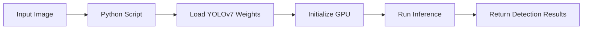

This worked for development, but introduced several production limitations.

| Problem                         | Impact                    |
| ------------------------------- | ------------------------- |
| Model loaded every execution    | Increased startup latency |
| No standard API                 | Difficult integration     |
| Manual environment setup        | Deployment inconsistency  |
| Script-based execution          | Limited scalability       |
| No service lifecycle management | Harder monitoring         |

---

# 3. New TorchServe Architecture

After migration, the model operates as a persistent inference service.

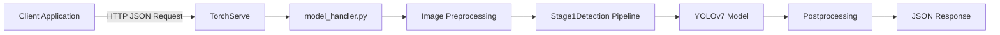

The new workflow:

1. TorchServe starts.
2. Model archive is loaded.
3. YOLOv7 remains loaded in GPU memory.
4. Applications send HTTP requests.
5. Predictions are returned as JSON.

---

# 4. Before vs After Migration

## Before

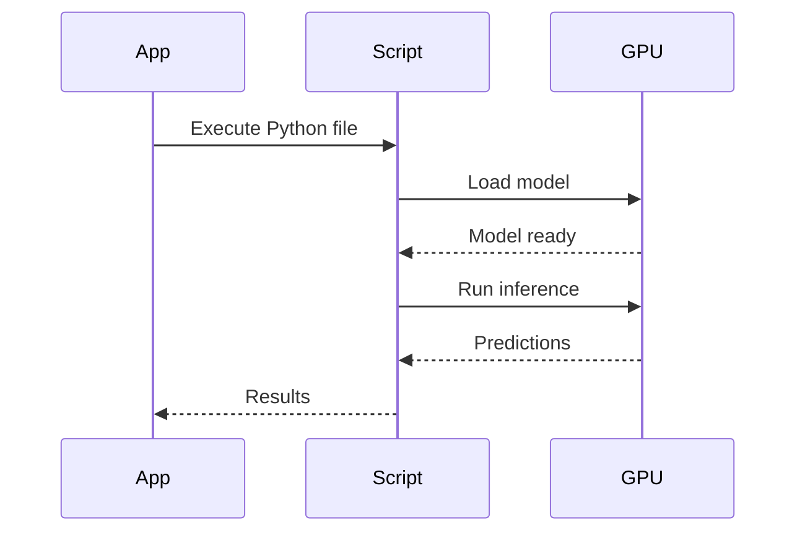

## After

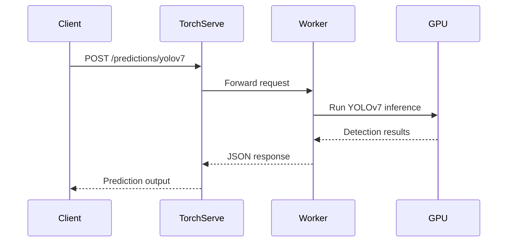

---

# 5. RTX 5090 / Blackwell GPU Environment

This migration was performed specifically for NVIDIA RTX 5090 Blackwell GPUs.

Although YOLOv7 itself is hardware independent, the complete inference stack depends on compatibility between:

* NVIDIA drivers
* CUDA runtime
* PyTorch
* TorchServe
* OpenCV
* model dependencies

The Docker environment packages these components together.

## Runtime Stack

| Component   | Version                                      |
| ----------- | -------------------------------------------- |
| GPU         | NVIDIA RTX 5090                              |
| CUDA        | 12.8                                         |
| Base Image  | `nvidia/cuda:12.8.1-cudnn-devel-ubuntu22.04` |
| PyTorch     | 2.7.0                                        |
| TorchVision | 0.22.0                                       |
| TorchAudio  | 2.7.0                                        |
| TorchServe  | Installed via pip                            |

---

# 6. Why Docker Is Used

Docker creates a reproducible runtime environment.

Without Docker:

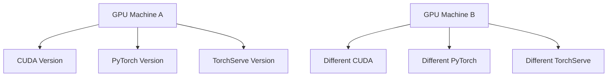

Different environments can produce different behavior.

With Docker:

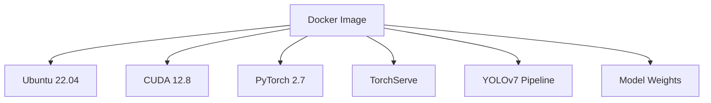

Every deployment uses the same stack.

---

# 7. High-Level System Flow

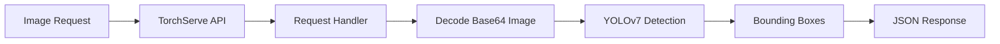

The service converts:

```
Image Input
     |
     v
YOLOv7 Processing
     |
     v
Detection JSON
```

---

# 8. Key Takeaways

The migration transformed the project from:

```
A Python script that runs inference
```

into:

```
A GPU-backed computer vision service
```

The resulting system provides:

* persistent GPU model loading
* HTTP-based inference
* Docker reproducibility
* easier debugging
* production-oriented deployment
# 9. What is TorchServe?

TorchServe is a model serving framework designed specifically for deploying PyTorch models as production services.

Instead of developers manually running Python scripts, TorchServe provides a standardized server layer responsible for:

* loading models
* managing model workers
* handling HTTP requests
* executing inference
* returning responses
* exposing health endpoints

The model becomes an API service.

---

# 10. TorchServe Request Lifecycle

The lifecycle of a request through this system:

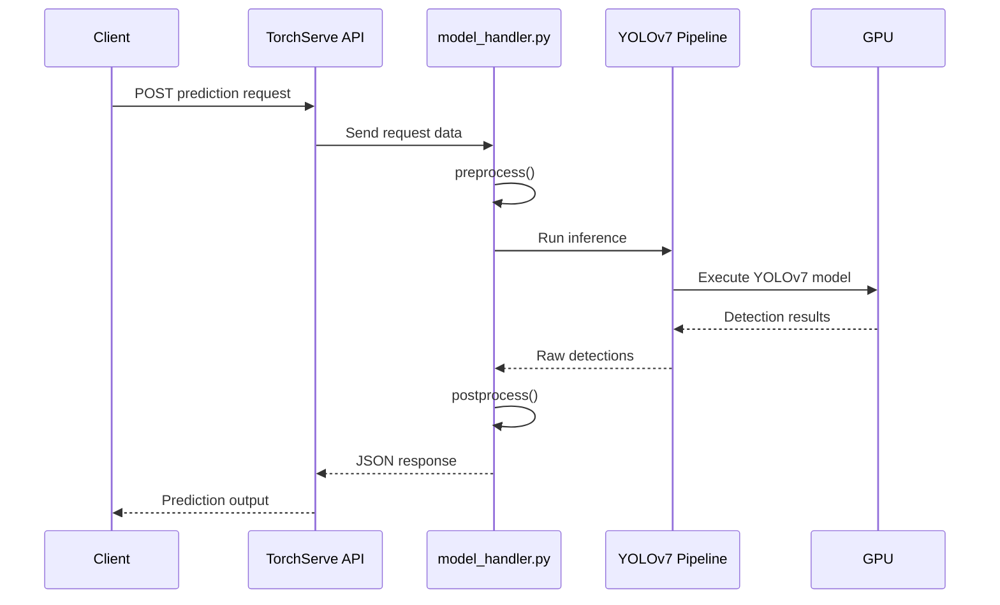

---

# 11. TorchServe Components Used

This project uses three TorchServe endpoints.

| Port | Endpoint Type  | Purpose                      |
| ---- | -------------- | ---------------------------- |
| 8080 | Inference API  | Receives prediction requests |
| 8081 | Management API | Checks loaded models         |
| 8082 | Metrics API    | Provides runtime metrics     |

---

## Inference API

The inference endpoint receives images and returns detections.

Example:

```bash
curl \
-X POST \
http://localhost:8080/predictions/yolov7 \
-H "Content-Type: application/json" \
--data-binary @request.json
```

---

## Management API

Used to verify that models are loaded.

Example:

```bash
curl http://localhost:8081/models
```

Expected:

```json
[
  {
    "modelName": "yolov7"
  }
]
```

---

## Metrics API

Provides runtime statistics.

Example:

```bash
curl http://localhost:8082/metrics
```

Metrics can be used for:

* latency monitoring
* worker monitoring
* production debugging

---

# 12. Repository Walkthrough

The repository contains the complete inference stack:

```
cv-singleline-detector-yolo7_det_dep_2/

├── best.pt
├── model_handler.py
├── Dockerfile
├── config.properties
├── request.json
├── codec_gpu.py
├── common_config_gpu.py
├── service_pipeline_gpu/
├── yolov7/
├── yolov7-seg/
└── requirements.txt
```

---

# 13. Important Files Explained

## model_handler.py

This is the most important file in the repository.

TorchServe calls this file whenever an inference request arrives.

The handler connects the TorchServe framework to the YOLOv7 inference pipeline.

Responsibilities:

* receive requests
* decode images
* prepare model inputs
* execute inference
* format responses

---

## Handler Lifecycle

```mermaid
flowchart TD

A[TorchServe Starts] --> B[Load Handler]

B --> C[initialize(context)]

C --> D[Load YOLOv7 Model]

D --> E[Wait For Requests]

E --> F[handle(request)]

F --> G[preprocess()]

G --> H[inference()]

H --> I[postprocess()]

I --> J[Return JSON]
```

---

# 14. model_handler.py Breakdown

## Initialization

During startup:

```python
def initialize(self, context):
```

TorchServe creates the model worker.

The handler:

1. checks GPU availability
2. creates pipeline configuration
3. loads the YOLOv7 model

Example startup log:

```
[Handler] Initializing on GPU

[Handler] Loading Stage 1 — YOLOv7 detection model

[Handler] Stage 1 ready.
```

---

# Preprocessing

Function:

```python
def preprocess(self, request)
```

Purpose:

Convert the incoming HTTP request into a format the model understands.

The handler expects:

```json
{
 "instances":[
   {
     "model_name":"detection",
     "file":"base64-image"
   }
 ]
}
```

The flow:

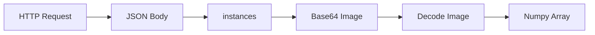

---

# Inference

Function:

```python
def inference(self, model_input)
```

The handler passes the processed image into:

```python
Stage1Detection.run_inference()
```

The YOLOv7 model produces:

* bounding boxes
* confidence scores
* class IDs

---

# Postprocessing

Function:

```python
def postprocess(self, result)
```

The raw model output is converted into API response format.

Example:

Input:

```
YOLO Detection Result
```

Output:

```json
{
 "predictions":[
   {
    "detections":[
      [
       4304,
       92,
       4835,
       407,
       0.88,
       0
      ]
    ]
   }
 ]
}
```

---

# 15. Pipeline Components

## service_pipeline_gpu/

This directory contains the GPU inference pipeline.

Responsibilities:

* model loading
* detection execution
* GPU configuration
* result generation

---

## codec_gpu.py

Responsible for image conversion.

Functions include:

* Base64 decoding
* image conversion
* output formatting

The handler depends on this file to translate API input into model input.

---

## common_config_gpu.py

Contains GPU runtime configuration.

Responsibilities:

* device selection
* inference configuration
* environment setup

---

## best.pt

The trained YOLOv7 model weights.

During Docker build:

```
best.pt
    |
    |
torch-model-archiver
    |
    |
yolov7.mar
```

The weights become part of the TorchServe model archive.

---

# 16. Configuration Files

## config.properties

Controls TorchServe behavior.

Current configuration:

```properties
inference_address=http://0.0.0.0:8080

management_address=http://0.0.0.0:8081

metrics_address=http://0.0.0.0:8082

min_workers=2

max_workers=4

default_workers_per_model=2
```

---

# Worker Configuration Explained

Workers are independent TorchServe processes.

Example:

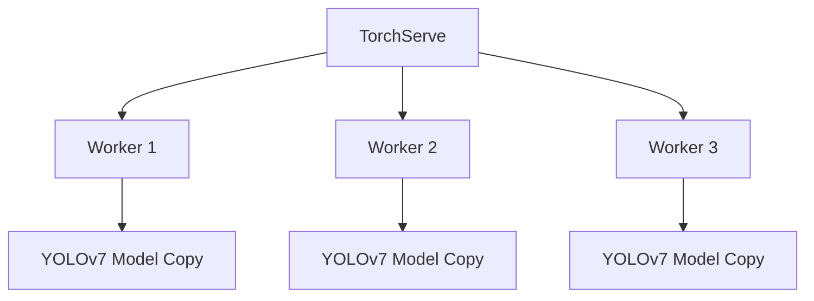

Each worker loads its own model instance.

Benefits:

* more simultaneous requests
* improved throughput

Cost:

* higher GPU memory usage

---

# 17. Why This Architecture Scales Better

The old system:

```
Application
 |
Python Script
 |
Model
```

The new system:

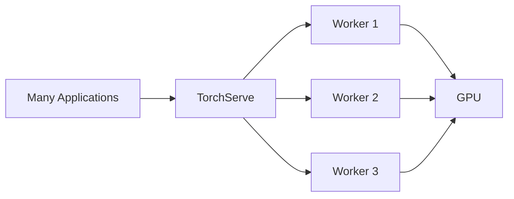

Multiple applications can consume the same inference service without managing the model directly.

---

# 18. Docker Environment Walkthrough

## Why Docker Is Central To This Deployment

The Docker image is responsible for creating the complete runtime environment required for inference.

The image packages:

* operating system
* CUDA runtime
* cuDNN libraries
* Python environment
* PyTorch
* TorchServe
* YOLOv7 source code
* model weights
* supporting libraries

The resulting container can be moved between compatible GPU machines without rebuilding the environment manually.

---

# Docker Runtime Architecture

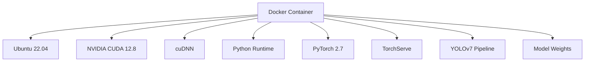

---

# 19. Dockerfile Explanation

The Dockerfile defines how the inference environment is created.

The main stages are:

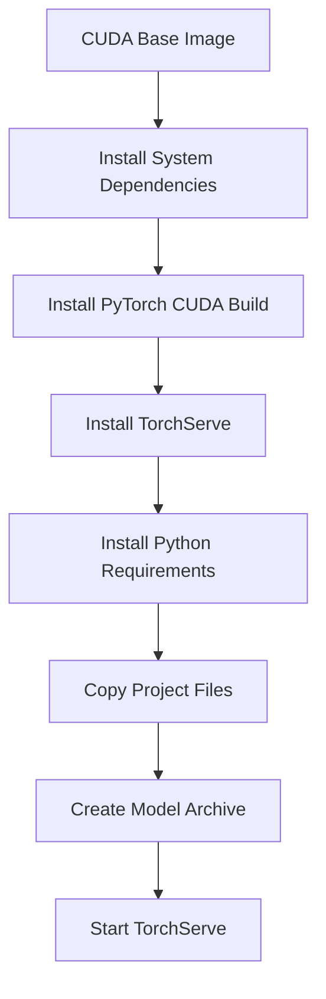

---

# Base Image

Current image:

```dockerfile
FROM nvidia/cuda:12.8.1-cudnn-devel-ubuntu22.04
```

This provides:

* Ubuntu 22.04
* CUDA 12.8 runtime
* cuDNN acceleration libraries

The CUDA version must match the PyTorch CUDA build.

---

# Python Environment

The container installs:

```dockerfile
python3
python3-pip
python3-dev
```

Python is required for:

* TorchServe
* YOLOv7
* inference pipeline code
* supporting libraries

---

# PyTorch Installation

The Dockerfile installs CUDA-enabled PyTorch:

```dockerfile
pip3 install \
torch==2.7.0 \
torchvision==0.22.0 \
torchaudio==2.7.0 \
--index-url https://download.pytorch.org/whl/cu128
```

This is important because a CPU-only PyTorch installation would ignore the RTX 5090 GPU.

---

# TorchServe Installation

TorchServe packages:

```dockerfile
pip3 install \
torchserve \
torch-model-archiver
```

Two components are installed:

| Package              | Purpose                    |
| -------------------- | -------------------------- |
| torchserve           | Runs the model server      |
| torch-model-archiver | Creates `.mar` model files |

---

# Project Files

The repository is copied:

```dockerfile
COPY . .
```

After this step, the container contains:

```text
/app

├── model_handler.py
├── best.pt
├── service_pipeline_gpu/
├── codec_gpu.py
├── common_config_gpu.py
└── config.properties
```

---

# 20. Model Archive Creation (.mar)

TorchServe does not directly load:

```
best.pt
```

Instead, it loads a Model Archive:

```
yolov7.mar
```

The `.mar` file contains everything required to execute the model.

---

# Model Archive Structure

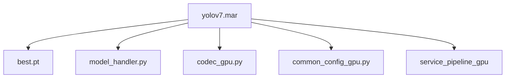

---

# Creating the Model Archive

The Docker build runs:

```bash
torch-model-archiver \
--model-name yolov7 \
--version 1.0 \
--handler model_handler.py \
--serialized-file best.pt \
--extra-files "yolov7/,service_pipeline_gpu/,codec_gpu.py,common_config_gpu.py"
```

This packages:

* weights
* handler
* dependencies
* pipeline code

into:

```
yolov7.mar
```

---

# Model Store

TorchServe loads models from:

```
model_store/
```

Example:

```text
model_store/

└── yolov7.mar
```

When TorchServe starts:

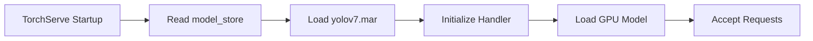

---

# 21. Building the Docker Image

The image is built with:

```bash
docker build -t hd-det-gpu .
```

During the build:

1. CUDA environment is created.
2. PyTorch is installed.
3. TorchServe is installed.
4. Dependencies are installed.
5. Model archive is created.
6. Image is saved.

---

# Build Verification

A successful build should show:

```text
Successfully built <image-id>

Successfully tagged hd-det-gpu:latest
```

Verify:

```bash
docker images
```

Expected:

```text
hd-det-gpu     latest
```

---

# 22. Running the Container

The container must receive GPU access.

Correct command:

```bash
docker run \
--gpus all \
-p 8080:8080 \
-p 8081:8081 \
-p 8082:8082 \
--name hd-det-test \
hd-det-gpu
```

---

# Docker Runtime Options Explained

| Flag           | Purpose              |
| -------------- | -------------------- |
| `--gpus all`   | Provides GPU access  |
| `-p 8080:8080` | Inference API        |
| `-p 8081:8081` | Management API       |
| `-p 8082:8082` | Metrics API          |
| `--name`       | Container identifier |

---

# Container Startup Flow

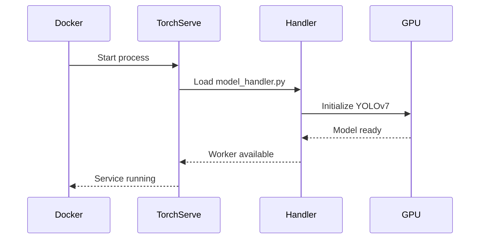

---

# 23. Verification Workflow

A successful deployment should be verified in layers.

Do not immediately test inference.

Each verification step proves something different.

---

# Step 1: Verify GPU

Command:

```bash
nvidia-smi
```

Confirms:

* GPU detected
* NVIDIA driver available
* CUDA compatibility

Example:

```text
GPU Name: NVIDIA RTX 5090
CUDA Version: 12.8
```

---

# Step 2: Verify TorchServe

Command:

```bash
curl http://localhost:8080/ping
```

Expected:

```json
{
 "status":"Healthy"
}
```

This confirms:

* TorchServe process is running
* API is reachable

It does **not** confirm the model loaded.

---

# Step 3: Verify Model Loading

Command:

```bash
curl http://localhost:8081/models
```

Expected:

```json
[
 {
  "modelName":"yolov7"
 }
]
```

This confirms:

* model archive loaded
* worker initialized
* TorchServe recognizes the model

---

# Step 4: Test Full Inference

Command:

```bash
curl \
-X POST \
http://localhost:8080/predictions/yolov7 \
-H "Content-Type: application/json" \
--data-binary @request.json
```

This validates:


---

# 24. Understanding Verification Failures

A useful debugging rule:

| Check              | Failure Means                |
| ------------------ | ---------------------------- |
| `nvidia-smi` fails | GPU environment problem      |
| `/ping` fails      | TorchServe startup problem   |
| `/models` fails    | Model loading problem        |
| Prediction fails   | Request or inference problem |

---

# 26. Running Inference

## Request Format

The TorchServe handler expects a JSON request.

It does **not** expect a raw image upload.

The request format was intentionally designed around the inference pipeline requirements.

Expected structure:

```json
{
  "instances": [
    {
      "model_name": "detection",
      "file": "<base64 encoded image>"
    }
  ]
}
```

---

# Request Processing Flow

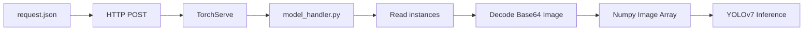

---

# Why Base64 Images Are Used

The API communicates through JSON.

Images are binary data, so they must be converted into text before being included in JSON.

The workflow:

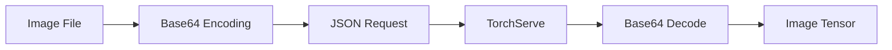

---

# Correct Request

Example:

```bash
curl \
-X POST \
http://localhost:8080/predictions/yolov7 \
-H "Content-Type: application/json" \
--data-binary @request.json
```

---

# Incorrect Request

Example:

```bash
curl \
-T image.jpg \
http://localhost:8080/predictions/yolov7
```

This sends:

```
image bytes
```

instead of:

```
JSON object
```

The handler cannot locate:

```python
request[0]["body"]["instances"]
```

because the expected dictionary structure does not exist.

---

# 27. Understanding Model Output

The handler returns detection results as JSON.

Example:

```json
{
 "predictions":[
  {
   "detections":[
    [
     4304,
     92,
     4835,
     407,
     0.88,
     0
    ]
   ]
  }
 ]
}
```

---

# Detection Format

Each detection follows:

```
[xmin, ymin, xmax, ymax, confidence, class_id]
```

| Value      | Meaning                        |
| ---------- | ------------------------------ |
| xmin       | Left bounding box coordinate   |
| ymin       | Top bounding box coordinate    |
| xmax       | Right bounding box coordinate  |
| ymax       | Bottom bounding box coordinate |
| confidence | Model confidence score         |
| class_id   | Detected object class          |

---

# Example Interpretation

Given:

```
[4304,92,4835,407,0.88,0]
```

The model detected:

* object location:

  * x range: 4304 → 4835
  * y range: 92 → 407
* confidence:

  * 88%
* class:

  * class 0

---

# 28. Common Migration Issues

This section documents issues discovered during the migration.

These problems are important because they highlight differences between:

* standalone Python inference
* production model serving

---

# Issue 1: Preprocessing Failed

## Symptom

The response:

```json
{
 "error":"preprocessing failed"
}
```

---

## Cause

The handler expects:

```python
request[0]["body"]["instances"]
```

However, raw uploads produce:

```python
request[0]["body"]
```

as a byte array.

The structure is different.

---

## Solution

Send JSON:

```bash
--data-binary @request.json
```

with:

```json
{
 "instances":[
  {
   "model_name":"detection",
   "file":"base64-image"
  }
 ]
}
```

---

# Issue 2: bytearray indices must be integers

## Error

Example:

```
bytearray indices must be integers
```

---

## Cause

TorchServe received raw image bytes.

The handler attempted:

```python
request[0]["body"]["instances"]
```

but:

```python
request[0]["body"]
```

was:

```
bytearray(...)
```

instead of:

```
dictionary
```

---

## Lesson Learned

HTTP content type changes the data structure received by the handler.

JSON:

```
Dictionary
 |
instances
 |
image
```

Raw upload:

```
Byte Array
```

---

# Issue 3: `/ping` Works But Prediction Fails

## Symptom

TorchServe reports:

```json
{
 "status":"Healthy"
}
```

but inference returns errors.

---

## Cause

`/ping` only checks:

* TorchServe process exists
* API responds

It does not verify:

* model loaded
* weights loaded
* GPU initialized
* handler succeeded

---

## Correct Debugging Sequence

```mermaid id="2l8vwr"
flowchart TD

A[nvidia-smi]

--> B[/ping]

--> C[/models]

--> D[Test Prediction]

--> E[Inspect Logs]
```

---

# Issue 4: Model Does Not Load

## Possible Causes

---

## Missing Model Archive

Check:

```bash
ls model_store
```

Expected:

```
yolov7.mar
```

---

## Missing Extra Files

The archive requires:

```
codec_gpu.py

common_config_gpu.py

service_pipeline_gpu/
```

If these are missing:

imports fail during initialization.

---

## Incorrect Configuration

Check:

```bash
cat config.properties
```

Verify:

* ports
* worker count
* model store path

---

# Issue 5: GPU Not Found

## Check GPU

```bash
nvidia-smi
```

---

## Common Cause

Container started without GPU access.

Incorrect:

```bash
docker run hd-det-gpu
```

Correct:

```bash
docker run --gpus all hd-det-gpu
```

---

# 29. Daily Development Workflow

This section describes the normal development process.

---

# Step 1: Pull Latest Changes

```bash
git pull
```

---

# Step 2: Rebuild Docker Image

Required when changing:

* Dockerfile
* Python dependencies
* TorchServe configuration
* model files

Command:

```bash
docker build -t hd-det-gpu .
```

---

# Step 3: Stop Existing Container

View containers:

```bash
docker ps
```

Stop:

```bash
docker stop hd-det-test
```

Remove:

```bash
docker rm hd-det-test
```

---

# Step 4: Start New Container

```bash
docker run \
--gpus all \
-p 8080:8080 \
-p 8081:8081 \
-p 8082:8082 \
--name hd-det-test \
hd-det-gpu
```

---

# Step 5: Verify Startup

Run:

```bash
curl localhost:8080/ping
```

Then:

```bash
curl localhost:8081/models
```

---

# Step 6: Run Inference Test

```bash
curl \
-X POST \
http://localhost:8080/predictions/yolov7 \
-H "Content-Type: application/json" \
--data-binary @request.json
```

---

# Step 7: Inspect Logs

Primary debugging command:

```bash
docker logs hd-det-test
```

Logs provide:

* TorchServe startup information
* model loading status
* CUDA initialization
* inference errors

---

# Useful Docker Commands

| Command                   | Purpose                 |
| ------------------------- | ----------------------- |
| `docker ps`               | View running containers |
| `docker logs <container>` | View logs               |
| `docker images`           | View images             |
| `docker stop <container>` | Stop container          |
| `docker rm <container>`   | Remove container        |

---

# 30. Migration Lessons Learned

## TorchServe Changes the Application Model

Before:

```mermaid id="7v2l2d"
flowchart LR

A[Run Script]

--> B[Load Model]

--> C[Inference]

--> D[Exit]
```

After:

```mermaid id="p2xj9r"
flowchart LR

A[Start Service]

--> B[Load Model Once]

--> C[Wait For Requests]

--> D[Process Continuously]
```

The model becomes a service rather than a script.

---

# Request Format Is Critical

A common migration mistake is assuming:

```
Image Upload
=
JSON Request
```

They are different.

TorchServe exposes the request exactly according to the HTTP content type.

The handler was designed around structured JSON input.

---

# Health Checks Are Layered

A reliable validation process:

## Infrastructure

```bash
nvidia-smi
```

Checks:

GPU availability.

---

## Service

```bash
curl localhost:8080/ping
```

Checks:

TorchServe availability.

---

## Model

```bash
curl localhost:8081/models
```

Checks:

Model loading.

---

## Application

Send inference request.

Checks:

Complete pipeline.

---

# Worker Configuration Matters

Current:

```properties
min_workers=2
max_workers=4
default_workers_per_model=2
```

Workers improve concurrency.

However:

Each worker loads a model copy.

Therefore:

More workers:

* increase throughput
* increase GPU memory usage

Worker count should be tuned based on:

* GPU memory
* request volume
* latency requirements

---
# 31. Final System Architecture

The completed system can be viewed as a complete inference platform rather than a single model.

```mermaid
flowchart TB

subgraph Client Layer
    A[Downstream Application]
    B[Testing Tools]
end

subgraph API Layer
    C[TorchServe Inference API<br/>Port 8080]
    D[TorchServe Management API<br/>Port 8081]
    E[TorchServe Metrics API<br/>Port 8082]
end

subgraph Serving Layer
    F[model_handler.py]

    F --> G[Request Processing]
    G --> H[Base64 Image Decoder]
    H --> I[Inference Pipeline]
end

subgraph Model Layer
    I --> J[Stage1Detection]
    J --> K[YOLOv7 Model]
    K --> L[RTX 5090 GPU]
end

subgraph Runtime Layer
    M[Docker Container]
    M --> C
    M --> D
    M --> E
    M --> F
    M --> L
end

A --> C
B --> C
```

---

# 32. Production Deployment Considerations

The current migration provides the foundation for production deployment.

Before production rollout, several areas should be evaluated.

---

# GPU Resource Management

The RTX 5090 provides significant inference capability, but GPU memory remains a shared resource.

Important factors:

* model size
* worker count
* concurrent requests
* image resolution

The current worker configuration:

```properties
min_workers=2
max_workers=4
default_workers_per_model=2
```

should be tuned through performance testing.

---

# Worker Scaling Tradeoff

Increasing workers:

Advantages:

* more simultaneous requests
* better throughput

Disadvantages:

* each worker loads a model copy
* increased GPU memory usage

Example:

```mermaid
flowchart LR

A[More Workers]

--> B[Higher Throughput]

A --> C[More Model Copies]

C --> D[Higher GPU Memory Usage]
```

The optimal configuration depends on production traffic.

---

# Monitoring Recommendations

The current system exposes a metrics endpoint:

```bash
curl localhost:8082/metrics
```

Future monitoring could track:

* request latency
* inference duration
* GPU utilization
* memory usage
* failed requests
* worker availability

---

# 33. Future Improvements

## 1. Automated Deployment

Currently deployment requires manual Docker commands.

Future improvements:

* CI/CD pipeline
* automatic image builds
* automated testing
* GPU server deployment scripts

Example workflow:

```mermaid
flowchart LR

A[Code Change]

--> B[CI Build]

--> C[Docker Image]

--> D[Automated Tests]

--> E[GPU Deployment]
```

---

# 2. Model Version Management

Currently:

```text
yolov7.mar
```

contains:

```text
version 1.0
```

Future improvements:

* model version tracking
* rollback support
* A/B testing

Example:

```text
model_store/

├── yolov7_v1.mar
├── yolov7_v2.mar
└── yolov7_latest.mar
```

---

# 3. Performance Benchmarking

Future testing should measure:

## Latency

Time from:

```text
Request Received
        |
        v
Prediction Returned
```

---

## Throughput

Requests processed per second.

---

## GPU Utilization

Monitor:

```bash
nvidia-smi
```

during inference workloads.

---

# 4. Additional API Validation

The current handler assumes valid input.

Future improvements:

* schema validation
* clearer error messages
* request size limits
* invalid image handling

Example:

Current:

```json
{
 "error":"preprocessing failed"
}
```

Improved:

```json
{
 "error":{
   "type":"INVALID_IMAGE",
   "message":"Base64 image could not be decoded"
 }
}
```

---

# 34. Troubleshooting Reference

## Quick Diagnostic Flow

When inference fails:

```mermaid
flowchart TD

A[Inference Failed]

A --> B{GPU Available?}

B -->|No| C[Check nvidia-smi]

B -->|Yes| D{TorchServe Running?}

D -->|No| E[Check Docker Logs]

D -->|Yes| F{Model Loaded?}

F -->|No| G[Check /models]

F -->|Yes| H{Request Valid?}

H -->|No| I[Check JSON Format]

H -->|Yes| J[Debug Handler]
```

---

# Common Commands

## GPU

```bash
nvidia-smi
```

---

## Containers

List:

```bash
docker ps
```

Logs:

```bash
docker logs hd-det-test
```

Stop:

```bash
docker stop hd-det-test
```

Remove:

```bash
docker rm hd-det-test
```

---

## Images

List:

```bash
docker images
```

Remove:

```bash
docker rmi <image>
```

---

## TorchServe

Health:

```bash
curl localhost:8080/ping
```

Models:

```bash
curl localhost:8081/models
```

Metrics:

```bash
curl localhost:8082/metrics
```

---

# 35. Summary

This migration transformed the Home Depot Single-Line Detection pipeline from a manually executed YOLOv7 Python workflow into a GPU-backed inference service.

The major architectural changes were:

| Before                  | After                    |
| ----------------------- | ------------------------ |
| Python script execution | TorchServe service       |
| Manual model loading    | Persistent model loading |
| Direct function calls   | HTTP API requests        |
| Local environment setup | Docker-based deployment  |
| Limited scalability     | Worker-based serving     |

---

# Final Architecture Summary

```mermaid
flowchart LR

A[Image Input]

--> B[HTTP JSON Request]

--> C[TorchServe]

--> D[model_handler.py]

--> E[YOLOv7 Pipeline]

--> F[RTX 5090 GPU]

--> G[Detection Results]

--> H[JSON Response]
```

The final system provides:

* reproducible deployment
* Blackwell GPU compatibility
* standardized inference API
* persistent GPU model loading
* easier integration with downstream applications
* improved maintainability

---

# Developer Checklist

Before considering the service healthy:

## Environment

* [ ] NVIDIA GPU detected
* [ ] CUDA available
* [ ] Docker installed
* [ ] NVIDIA Container Toolkit installed

## Build

* [ ] Docker image builds successfully
* [ ] Model archive created
* [ ] Dependencies installed

## Runtime

* [ ] Container starts
* [ ] `/ping` returns healthy
* [ ] `/models` shows YOLOv7
* [ ] GPU utilization increases during inference

## Inference

* [ ] Request uses JSON format
* [ ] Base64 image included
* [ ] Detection response returned

---

# End of Document

